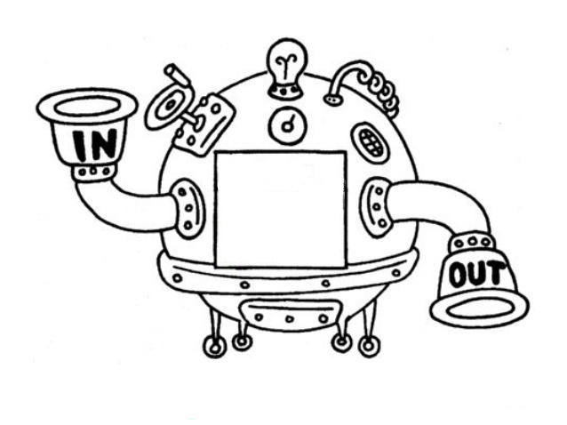
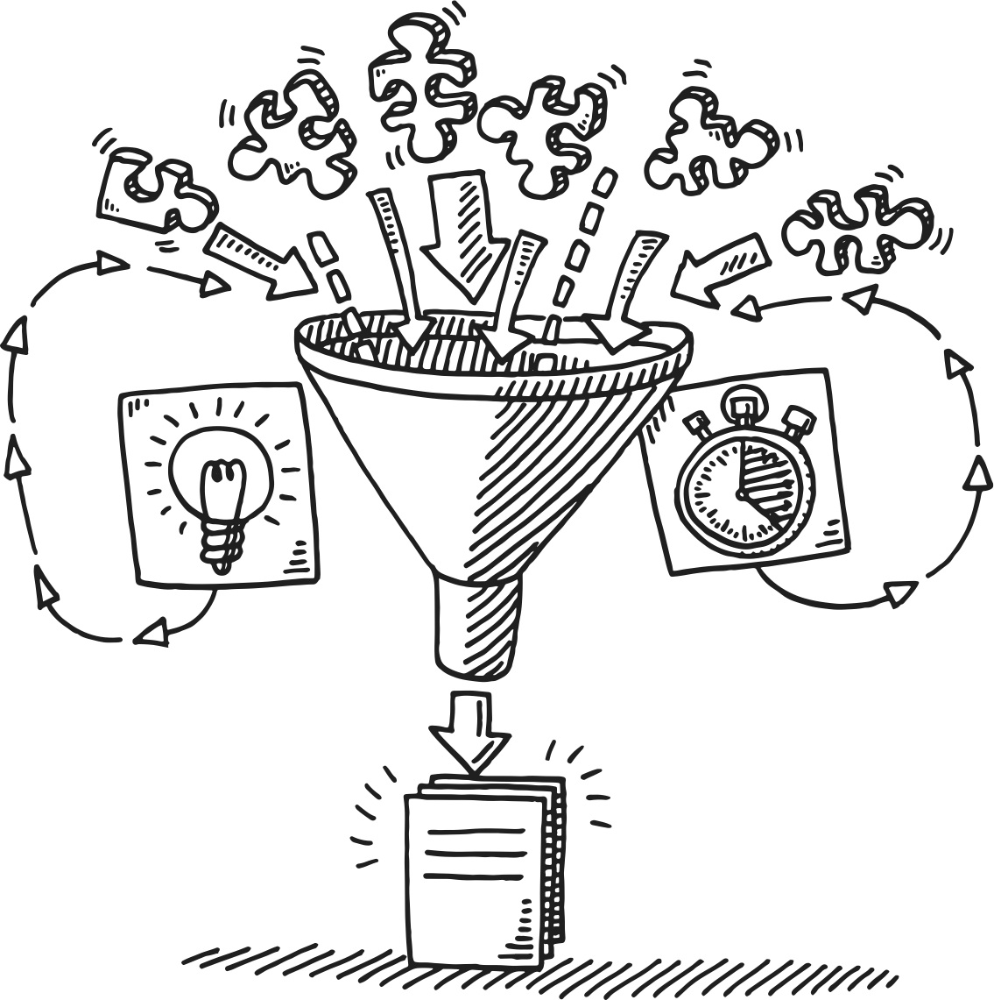
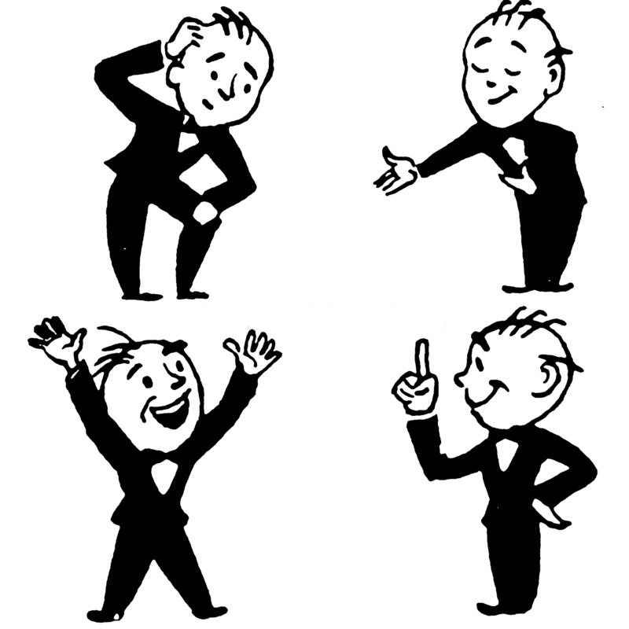

<!DOCTYPE html>
<html lang="pt">

<head>

  <!-- Global site tag (gtag.js) - Google Analytics -->
  
  

  <meta charset="utf-8">
  <meta content="width=device-width, initial-scale=1.0" name="viewport">

  <title>OPS Framework</title>
  <meta content="" name="descriptison">
  <meta content="" name="keywords">

  <link href="assets/img/icon.gif" rel="icon">
  <link href="assets/img/icon.gif" rel="apple-touch-icon">

  <!-- Google Fonts -->
  <link href="https://fonts.googleapis.com/css?family=Codystar:300,300i,400,400i,600,600i,700,700i|Domine:300,300i,400,400i,500,500i,600,600i,700,700i|Zilla+Slab:300,300i,400,400i,500,500i,600,600i,700,700i|Recursive:300,300i,400,400i,500,500i,600,600i,700,700i" rel="stylesheet">

  <!-- Vendor CSS Files -->
  <link href="assets/vendor/bootstrap/css/bootstrap.min.css" rel="stylesheet">
  <link href="assets/vendor/icofont/icofont.min.css" rel="stylesheet">
  <link href="assets/vendor/boxicons/css/boxicons.min.css" rel="stylesheet">
  <link href="assets/vendor/venobox/venobox.css" rel="stylesheet">
  <link href="assets/vendor/owl.carousel/assets/owl.carousel.min.css" rel="stylesheet">
  <link href="assets/vendor/aos/aos.css" rel="stylesheet">

  <!-- Template Main CSS File -->
  <link href="assets/css/style.css" rel="stylesheet">

</head>

<body>

  <!-- ======= Mobile nav toggle button ======= -->
  <button type="button" class="mobile-nav-toggle d-xl-none"><i class="icofont-navigation-menu"></i></button>

  <!-- ======= Header ======= -->
  <header id="header" class="d-flex flex-column justify-content-center">

    <nav class="nav-menu">
      <ul>
        <li class="active"><a href="#hero"><i class="bx bx-home"></i> Home</a></li>
        <li><a href="#about"><i class="bx bx-hive"></i> Contexto</a></li>
        <li><a href="#resume"><i class="bx bx-loader-circle"></i> Systems Thinking</a></li>
        <!--<li><a href="#portfolio"><i class="bx bx-book-content"></i> Portfolio</a></li>-->
        <li><a href="#services"><i class="bx bx-grid-alt"></i> Executando</a></li>
        <li><a href="#contact"><i class="bx bx-user-voice"></i> Feedback</a></li>
      </ul>
    </nav><!-- .nav-menu -->

  </header><!-- End Header -->

  <!-- ======= Hero Section ======= -->
  <section id="hero" class="d-flex flex-column justify-content-center">
    

        OPS
        <!--S
        S -->

      <h1>um Olhar Para o Sistema</h1>
      
Um framework para Engenharia de Requisitos 

    

  </section><!-- End Hero -->

  <main id="main">

    <!-- ======= About Section ======= -->
    <section id="about" class="about">
      

        

          <h2>Contexto</h2>
          

                        Softwares são intrínsecos ao mundo e à sociedade. Frequentemente dependemos deles para fazer nosso trabalho, ir a lugares, nos comunicar, nos informar, e por aí vai.
                        É por isso que alguns estudiosos já consideram que softwares são <b>pilares</b> dos sistemas sociotécnicos (o contexto maior que participam).
                          Além de "resolverem problemas" e orientarem parte do nosso comportamento, softwares ainda introduzem no mundo implicações e consequências, incluindo <b>efeitos de longo alcance</b>.
                        As implicações não são apenas comportamentais e econômicas, mas também <b>morais e éticas</b>.
                        Todos os efeitos do software são determinados pela forma que os analistas entendem e definem os requisitos.
                          Por isso é importante que múltiplas perspectivas sejam exploradas e os potenciais impactos do software sejam identificados e discutidos.
                        Isso requer <b>analisar o sistema como um todo</b>.  
                        Para isso o framework <b>Olhar Para o Sistema</b> foi criado!
                         
                        <!---->
          

        

      

    </section><!-- End About Section -->

    <!-- ======= Resume Section ======= -->
    <section id="resume" class="resume">
      <!-- ======= Facts Section ======= -->
      <section id="facts" class="facts">
        

          

            <h2>Coloque o sistema inteiro na sala!</h2>

            

              

                   
              

              

                <!-- <h3>UI/UX Designer &amp; Web Developer.</h3> -->

                
A visão sistêmica é essencial para entendermos o contexto da solução de software e calcularmos potenciais impactos.
                   Um sistema é um conjunto de elementos que atuam de forma organizada para alcançar um objetivo.
                   Há um sistema lá fora que aguarda a solução de software. Quem são os atores que terão contato com o sistema?
                  Quem são os indivíduos que não terão acesso, mas serão afetados? Quais são as ferramentas já presentes no sistema?
                  Como tudo isso se relaciona? Quais os efeitos que um tem sobre o outro?
  
                  
 A ideia de visualizar o sistema como um todo para entender problemas e situações originou a abordagem Systems Thinking.

              

            

   

            

              

                  <i class="bx bxs-quote-alt-left quote-icon-left"></i>
                  Systems Thinking é uma ferramenta crítica para conduzir muitos desafios políticos, econômicos, sociais e ambientais que enfrentamos pelo mundo e nos ajuda a gerenciar, adaptar e ver o enorme
                  conjunto de escolhas e oportunidades que temos.
                  <i class="bx bxs-quote-alt-right quote-icon-right"></i> - Thinking in systems: A primer   

                  <i class="bx bxs-quote-alt-left quote-icon-left"></i>
                  Systems Thinking pode ser entendida como uma linguagem - uma linguagem visual que nos ajuda a entender e
                  discutir sobre o mundo de uma forma diferente de nossa linguagem usual, que não é acurada para explicar complexidade.
                  <i class="bx bxs-quote-alt-right quote-icon-right"></i>
                   - Systems Thinking for social change  

              

              

                   
              

            

            

              

                   
              

              

                <!-- <h3>UI/UX Designer &amp; Web Developer.</h3> -->
               
              
Marvin Weisbord foi o systems thinker que criou o termo "coloque o sistema inteiro na sala!", o que significa que devemos trazer para análise o máximo possível de informação sobre o sistema que compõe a realidade.
              Propomos o framework <b>Olhar Para o Sistema</b> (OPS) para ser possível fazer isso no contexto de software. É preciso reunir os analistas que conhecem o contexto da solução e definiram os requisitos, e se possível, os stakeholders (que conhecem ainda mais).
              Um dos participantes precisa ser o guia para orientar a execução das atividades.

              

            

 

            

              

                
 O <b>Olhar Para o Sistema</b> tem o objetivo de identificar os potenciais impactos sistêmicos do software em uma abordagem ágil com duração de um dia (ou menos).
                O momento ideal para execução do framework é durante a definição dos requisitos ou na validação.

              

              

                
              

            

          

        

      </section><!-- End Facts Section -->
    </section><!-- End Resume Section -->

    <!-- ======= Services Section ======= -->
    <section id="services" class="services">
      

        

          <h2>Guia de execução</h2>
        

        <!-- ======= Portfolio Section ======= -->
        <section id="portfolio" class="portfolio section-bg">
          

            

              

                

                    

                        
                      <h4>Conscientização</h4>
                      
Por que estamos aqui?

                  

                  

                    

                      <a href="conscientizacao.html" data-gall="portfolioDetailsGallery" data-vbtype="iframe" class="venobox" title="Atividade 1"><i class="bx bx-plus"></i></a>
                    

                  

                

              

              

                

                    

                        
                      <h4>Construção do mapa</h4>
                      
Palavras não são suficientes!

                  

                  

                    

                      <a href="mapa.html" data-gall="portfolioDetailsGallery" data-vbtype="iframe" class="venobox" title="Atividade 2"><i class="bx bx-plus"></i></a>
                    

                  

                

              

              

                

                    

                        
                      <h4>Inclusão de requisitos</h4>
                      
Simulando como vai ser com o software

                  

                  

                    

                      <a href="requisitos.html" data-gall="portfolioDetailsGallery" data-vbtype="iframe" class="venobox" title="Atividade 3"><i class="bx bx-plus"></i></a>
                    

                  

                

              

              

                

                    

                        
                      <h4>Resposta aos questionários</h4>
                      
Hora de pensar à frente

                  

                  

                    

                      <a href="resposta.html" data-gall="portfolioDetailsGallery" data-vbtype="iframe" class="venobox" title="Atividade 4"><i class="bx bx-plus"></i></a>
                    

                  

                

              

              

                

                    

                        
                      <h4>Discussão e Análise</h4>
                      
Olhar para o sistema!

                  

                  

                    

                      <a href="discussao.html" data-gall="portfolioDetailsGallery" data-vbtype="iframe" class="venobox" title="Atividade 5"><i class="bx bx-plus"></i></a>
                    

                  

                

              

              

                

                    

                        
                      <h4>Diagramas de efeitos</h4>
                      
Sintetizando os resultados

                  

                  

                    

                      <a href="final.html" data-gall="portfolioDetailsGallery" data-vbtype="iframe" class="venobox" title="Atividade 6"><i class="bx bx-plus"></i></a>
                    

                  

                

              

            

          

        </section><!-- End Portfolio Section -->

      

    </section><!-- End Services Section -->

    <!-- ======= Contact Section ======= -->
    <section id="contact" class="contact">
      

        

          

            

              

            

          

          

            

              <h2>Feedback</h2>
            

            
Acesse o <a href="https://forms.gle/tWafutwxhV9Mxywh9" target="_blank">questionário</a> para avaliar o framework <b>Olhar Para o Sistema</b>.

          

        

      

    </section><!-- End Contact Section -->

  </main><!-- End #main -->

  <!-- ======= Footer ======= -->
  <footer id="footer">
    

      

        Framework <b>Olhar para o Sistema</b> • 2020
      

      

      

    

  </footer><!-- End Footer -->

  <a href="#" class="back-to-top"><i class="bx bx-up-arrow-alt"></i></a>
  

  <!-- Vendor JS Files -->
  
  
  
  
  
  
  
  
  
  
  

  <!-- Template Main JS File -->
  

</body>

</html>
